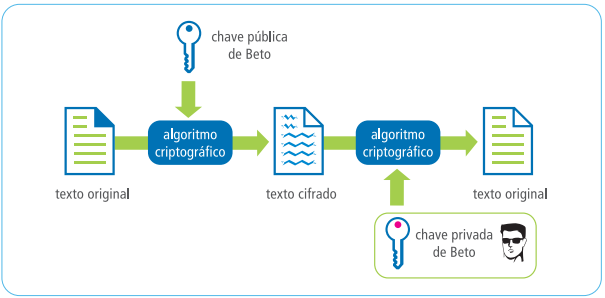

# HTTP: Entendendo a web por baixo dos panos

Esse é um resumo do curso HTTP: Entendendo a web por baixo dos panos da Alura com algumas adições minhas.

## Internet

Primeira coisa que pensamos quando ouvimos HTTP é na utilização da Internet, certo? Pois esse é o cenário onde vemos realmente na prática a utilização do HTTP.

Quando acessamos um site, sempre tem o `http://` na frente, e é interessante entendermos o que está por trás disso!

No momento que acessamos um site, existe uma comunicação entre o navegador (Chrome, Firefox,...) e o site. Essa comunicação tem duas partes bem conhecidas: Cliente e Servidor (ouvimos muito falar do Client-Server, né?).

Nesse exemplo, o navegador é o Cliente e o site é o Servidor (quem fornece o conteúdo).

A Internet é baseada nesse modelo, onde sempre há um cliente que solicita e um servidor que responde.

E para que ambas as partes consigam se entender com sucesso, existem algumas regras nessa comunicação. Esse conjunto de regras é um protocolo, que nesse caso é o protocolo HTTP.

Protocolos são definidos, especificados e disponibilizados para implementação em ambas as partes. Essa é a especificação do HTTP para você consultar: https://tools.ietf.org/html/rfc2616

## HTTP - Hypertext Transfer Protocol

É um protocolo que define as regras de comunicação entre cliente e servidor na Internet. 

O principal papel do HTTP é estabelecer regras na comunicação entre o modelo Cliente-Servidor que funciona na Web.

E porque precisamos disso? Vou exemplificar...

Se você compreende este texto que escrevi, é porque você sabe português! Para que alguém consiga se comunicar com você, esse alguém deverá usar o português (supondo que você desconheça outro idioma, é claro). Isso significa que, sua regra (protocolo) de comunicação com o mundo é a língua portuguesa, que define a forma com que as informações devem chegar até você (através do vocabulário, regras de gramática e etc). Uma outra pessoa que conheça português irá usar do mesmo formato, já que vocês possuem um idioma em comum.

Na internet, como já vimos, o idioma mais comum é o HTTP. Ele é responsável por definir a forma de como os dados são trafegados na rede através de várias regras. Portanto, todo mundo que conhece o idioma HTTP poderá receber e enviar dados e participar dessa conversa!

## HTTPS

O HTTP é o protocolo que define as regras de comunicação na web e quando o utilizamos, todos os dados enviados entre cliente e servidor são transmitidos em texto puro, inclusive dados sensíveis, como login e senha!

Quando acessamos um site e precisamos fazer uma autenticação (ou seja, informar nosso login e senha) e estamos usando HTTP, essas informações são enviadas em texto. E é muito fácil conseguir visualizá-las (só olhar nas ferramentas do desenvolvedor/inspect do navegador, na aba network). Ou seja: muito perigoso e inseguro.

Por isso, existe o HTTPS. Ele é basicamente o HTTP comum, porém com uma camada extra de segurança/criptografia que antes era SSL, mas posteriormente passou a ser também TLS. É muito comum que estas duas siglas sejam encontradas juntas como SSL/TLS (Secure Sockets Layer/Transport Layer Security) por se tratarem da mesma questap de segurança.

Note que quando acessamos um site com HTTPS, aparece um cadeado ao lado o `https://`. Clicando nesse cadeado, você consegue ver as informações sobre HTTPS.

Uma dessas indicações é que o site tem uma identidade confirmada. Mas o que isso quer dizer?

Para garantir a segurança, o HTTPS usa criptografia baseada em chaves públicas e privadas. Para gerar essas chaves, é preciso garantir a identidade de quem possui essas chaves, e isso é feito a partir de um certificado digital.

O certificado digital é utilizado para identificar determinada entidade e ainda é utilizada para geração das chaves de criptografia.

O certificado digital possui uma chave pública que vai criptografar os dados que o navegador envia para o servidor. 

E com essa chave pública, eu consigo criptografar os dados e lá do outro lado do servidor a aplicação tem uma chave que só ela sabe (chave privada) para descriptografar os dados.

É como se você guardasse os dados em uma caixinha, trancasse com um cadeado e enviasse esses dados protegidos até o servidor. E só servidor tem a chave (privada) para destrancar os dados que estão na caixinha.

Então qualquer intermediário nessa comunicação não conseguiria descriptografar e ter acesso a esses dados, pois precisaria da chave que só o servidor da aplicação conhece.

## Endereços

### IP

Quando acessamos o google, usamos o endereço `https://www.google.com`. 

Já sabemos que o endereço começa com http ou https. Repare que depois do protocolo, vem o `://` seguido pelo nome do site que é `www.google.com`, esse é o DOMÍNIO. 

Esses domínios são criados para termos algo fácil de lembrar. Mas na verdade a Internet funciona sem esses domínios.

Os nomes dos sites são só para os humanos, pois as máquinas têm uma outra forma de se endereçar. Elas usam os endereços IP, que nada mais são do que números.

Exemplo de IP do google: 142.250.79.14 (descobri usando o comando nslookup)

No final das contas, o que isso significa? Que você pode acessar o google tanto com `www.google.com` ou com `142.250.79.14`. Testa aí pra você ver!

Já pensou como seria difícil ter que gravar esse número para acessar o google? E para cada site que quisessemos acessar, também teríamos que gravar essa sequência numérica toda. Muito mais fácil com o domínio, né?

### DNS

Mas se a Internet entende IP e não o domínio do site, como conseguimos acessar usando o `www.google.com`?

Conseguimos porque quando realizamos uma requisição, essa URL é transformada em um número por um serviço transparente chamado de DNS (Domain Name System).

Esse serviço age como um grande banco de dados de domínio. Então quando realizamos a requisição, a URL é transformada em um número (o IP) pelo DNS, ele faz essa "tradução" de domínio para IP.

### Portas

A porta reservada para o protocolo HTTP é a porta 80.

Como o navegador já sabe que essa é a porta padrão, essa informação é omitida.

Ou seja, você pode acessar tanto com `http://www.google.com:80 ` como `http://www.google.com`. 

Se você tentar outra porta, 81 por exemplo, vai perceber que não vai funcionar. Isso porque essa porta não está aberta no servidor.

### Recursos

Navegando dentro da Alura, mais informações aparecem depois do nome e do domínio. Por exemplo, para acessar a página principal dos cursos, usamos https://cursos.alura.com.br/dashboard. O /dashboard é um recurso (resource) do site que gostaríamos de acessar. Existem vários outros recursos na Alura como as carreiras (/careers), ou o fórum de discussões (/forum). O importante é que cada recurso possua o seu nome único.

Navegando um pouco mais na Alura, podemos perceber que entre o domínio e o recurso podem vir outras informações . Por exemplo, para acessar o curso HTML5 e CSS3 I: Suas primeiras páginas da Web, usamos https://cursos.alura.com.br/course/introducao-html-css. Ou seja, para acessarmos o recurso /introducao-html-css, usamos um caminho intermediário, o /course. Há vários outros exemplos na Alura que usam caminhos para chegar ao recurso concreto, como por exemplo /courses/mine, e navegando na Alura você encontrará mais.

### URL

Repare que estamos usando umas regras bem definidas para descrever a localização de um recurso na web. Todos os endereços na web sempre seguem esse mesmo padrão: protocolo://dominio:porta/caminho/recurso. Esse padrão, na verdade, segue uma especificação que foi batizada de Uniform Resource Locator, abreviada como URL. Então, as URLs são os endereços na web!

## Modelo Requisição e Resposta

Quando entramos em um site, estamos sempre pedindo dados e recebendo dados. 

Quando requisitamos alguma página, ou seja, quando tentamos acessar um site, essa requisição enviada pelo navegador é chamada de HTTP REQUEST. Logo depois desse pedido, recebemos a página que queríamos, certo? Essa resposta é chamada de HTTP RESPONSE.

A comunicação segue sempre esse modelo: o cliente envia uma requisição e o servidor responde. Requisição e Resposta ou em inglês: Request-Response. Aqui é importante saber que a comunicação sempre começa com o cliente: é ele quem pede as informações. O servidor responde apenas o que foi requisitado e nunca inicia a comunicação!

## Comunicação sem estado

No HTTP, cada requisição é independente uma da outra. Por isso, todas as requisições devem conter todas as informações necessárias. Mas o que isso quer dizer?

Pense que HTTP funciona como o envio de cartas pelo correio e uma carta representa uma requisição. Você fez uma viagem e gostaria de enviar 3 cartas para sua mãe. Adianta falar para os correios "eu vou colocar o endereço apenas na primeira carta, ai vocês já sabem para onde enviar a segunda e terceira carta"? Não adianta pois os correios tratam cada carta independentemente, e assim também funciona o HTTP. Cada requisição (carta) precisa ter todas as informações. A mesma coisa se aplica para a resposta, precisa ter todas as informações.

Essa característica de cada requisição ser independente é chamada de stateless. É esse nome bonito mesmo! O HTTP é um protocolo que não mantém o estado de requisições. Isso significa que só com HTTP não há como se lembrar das requisições anteriores enviadas para o servidor. Por isso precisamos incluir em cada requisição todas as informações, sempre. Para o desenvolvedor este conhecimento é importante pois é justamente essa característica stateless que o atrapalha no dia a dia. Ele precisa preparar a aplicação web para que funcione bem usando o protocolo HTTP.

## Lidando com Sessões

Sabe quando você faz login em um site e ele guarda seu login mesmo que você esteja navegando em outras páginas ou outras abas?

Mas como isso funciona se o HTTP é stateless, ou seja, não guarda as informações enviadas anteriormente?

Então ele envia em todas as requisições as informações de login e senha? Não! Isso nem seria seguro, mas ele faz algo parecido com isso.

Quando efetuamos o login, o site valida os nossos dados, certo? Nesse momento, o servidor tem certeza que o usuário existe e gera uma identificação quase aleatória para o usuário. Essa identificação é um número criado ao vivo e muito difícil de adivinhar. Esse numero é a identificação temporária do usuário e ele será devolvido na resposta.

## Cookies

Então onde está esse número? O navegador grava esse número em um arquivo especial para cada site, são os famosos cookies. Como acessar esse cookie depende um pouco do navegador em uso. Normalmente o nome do cookie é algo como session-id.

Todas as plataformas ajudam a gerar esse número e a criar o cookie de maneira transparente. É dessa forma que as plataformas gerenciam as SESSÕES com o usuário e conseguem guardar informações entre requisições.

A ideia de manter dados entre requisições é algo muito comum no desenvolvimento de aplicações na web. Um usuário que se loga no sistema web causa a criação de uma sessão. Uma sessão então é útil para guardar informações sobre o usuário e ações dele. Um exemplo clássico é um carrinho de compras. Entre várias requisições estamos usando o mesmo carrinho de compras que guarda os nossos produtos escolhidos (fizemos uma sessão de compras online).

## Métodos HTTP

Conjunto de métodos de requisição que indicam a ação a ser executada para um dado recurso. Eles também podem ser chamados de Verbos HTTP.

### GET

Busca informações.

Exemplo: Busca informações de um usuário em um sistema.

### POST

Adiciona informações no servidor, cria recursos, informações no servidor.

Exemplo: Adicionar um novo usuário em um sistema.

### PUT

Atualiza dados no servidor.

Exemplo: Atualiza informações de um usuário em um sistema.

### DELETE

Deleta dados no servidor.

Exemplo: Deleta usuário em um sistema.

## Status Code

Em cada resposta HTTP existe um código de status (Status Code). Esse código indica qual foi o "resultado" da requisição. As respostas são agrupadas em 5 classes:

1xx - Respostas de Informação
2xx - Respostas de sucesso
3xx - Mensagem de redirecionamento
4xx - Respostas de erro do cliente
5xx - Respostas de erro do servidor

Dentro dessas classes, existem os códigos mais "famosos".

### Mais conhecidos

#### 200

O código 200 significa OK, ou Sucesso, que não houve nenhum problema no processamento da requisição e ela foi bem sucedida.

#### 302 e 302

A classe do código 3xx é relacionada com o redirecionamento.

Nesse caso, o cliente (navegador) deve tomar medidas extras para concluir o pedido. Normalmente são utilizados os códigos 301 ou 302, junto com o cabeçalho de resposta Location.

#### 404 - Not Found

É o código clássico que indica que o recurso não foi encontrado. Em geral, a classe 4xx indica que o cliente errou algo na requisição.

Quando o código de resposta é 403, significa que o cliente não tem a permissão.

#### 500 - Internal Server Error

A classe 5xx significa que houve algum problema no servidor.

Outro famoso: 503 - Service Unavailable.

O código 500 acontece com frequência quando estamos desenvolvendo uma aplicação web e, ao testar, percebemos que erramos algo na lógica que gerou um problema no servidor.